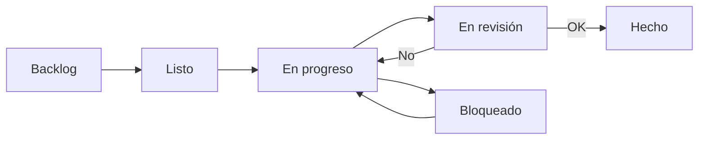

# Estructura del GitHub Project

Este documento describe el Project **App Loops · Automatizaciones IA** y cómo
sacarle partido siendo una sola persona.

## Campos personalizados

| Campo | Tipo | Valores |
|-------|------|---------|
| **Tipo** | Selección única | Iniciativa · Épica · Historia de Usuario · Tarea · Bug · Spike |
| **Estado** | Selección única | Backlog · Listo · En progreso · En revisión · Bloqueado · Hecho |
| **Prioridad** | Selección única | P0 - Crítica · P1 - Alta · P2 - Media · P3 - Baja |
| **Horizonte** | Selección única | Ahora · Siguiente · Después |
| **Esfuerzo** | Selección única | XS · S · M · L · XL |
| **Iniciativa** | Texto | Nombre de la iniciativa a la que pertenece |
| **Inicio** | Fecha | Cuándo empieza |
| **Fecha objetivo** | Fecha | Compromiso de entrega |

> El campo **Status** nativo de GitHub se mantiene para la vista Board por
> defecto; usa **Estado** como campo principal en español.

## Jerarquía real (sub-issues)

GitHub soporta *sub-issues*, así que la jerarquía se ve en el propio issue:

```
Iniciativa (INIT-x)
└── Épica (EPIC-x.y)          <- sub-issue de la Iniciativa
    └── Historia (US-x.y.z)   <- sub-issue de la Épica
```

El progreso de una épica/iniciativa se calcula solo a partir de sus hijas.

## Vistas recomendadas

Crea estas vistas una vez dentro del Project (`+ New view`):

### 1. Board · "Mi día"
- Tipo: **Board**
- Agrupar por: **Estado**
- Filtro: `horizon:"Ahora"`

### 2. Roadmap · "Timeline"
- Tipo: **Roadmap**
- Fechas: **Inicio** → **Fecha objetivo**
- Agrupar por: **Iniciativa**

### 3. Table · "Estructura"
- Tipo: **Table**
- Agrupar por: **Tipo**
- Ordenar por: **Prioridad**

### 4. Board · "Triage"
- Tipo: **Board**
- Agrupar por: **Prioridad**
- Filtro: `-tipo:"Historia de Usuario"` (solo iniciativas y épicas)

## Filtros que ahorran tiempo

| Quiero ver… | Filtro |
|-------------|--------|
| Mi foco de la semana | `horizon:"Ahora"` |
| Lo urgente | `priority:"P0 - Crítica","P1 - Alta"` |
| Lo que está bloqueado | `estado:"Bloqueado"` |
| Solo la estructura | `-tipo:"Historia de Usuario"` |
| Lo que vence pronto | ordena por **Fecha objetivo** ascendente |
| Historias listas para empezar | `estado:"Listo"` |

## Flujo de estados



## Automatizaciones integradas (workflows de GitHub)

Puedes activar en el Project (**⋯ → Workflows**):

- **Item closed → Done**: al cerrar un issue, pasa a `Hecho`.
- **Pull request merged → Done**: al fusionar un PR, cierra su issue.
- **Auto-add to project**: añade automáticamente issues con label `type:story`.
- **Item added → set Backlog**: por defecto todo entra en Backlog.

## Rutina semanal (1 persona)

| Día | Acción | Tiempo |
|-----|--------|--------|
| Lunes | Revisar vista "Mi día" y elegir 3 historias | 10 min |
| Diario | Actualizar Estado + Inicio | 2 min |
| Viernes | Revisar P0/P1 y fechas objetivo | 10 min |
| Fin de mes | Replanificar Siguiente → Ahora | 20 min |

## Añadir trabajo nuevo

1. Crea el issue con la plantilla correspondiente (Iniciativa / Épica / Historia).
2. Asígnale el label de tipo y prioridad.
3. Enlázalo como sub-issue de su padre.
4. Rellena `Tipo`, `Prioridad`, `Horizonte`, `Inicio`, `Fecha objetivo`.

O bien edita `roadmap/backlog.json` y re-ejecuta el workflow **Setup GitHub Project**.
